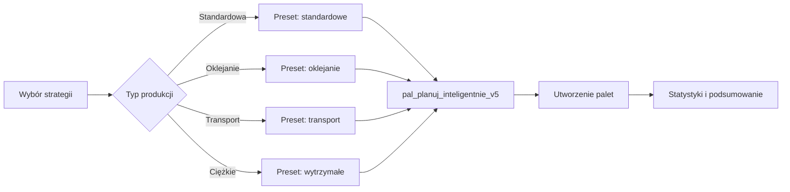
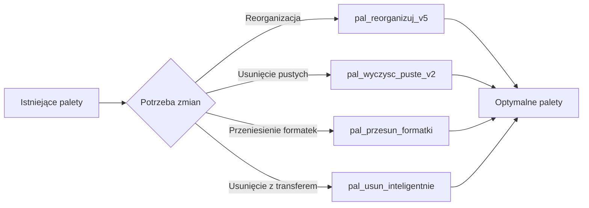
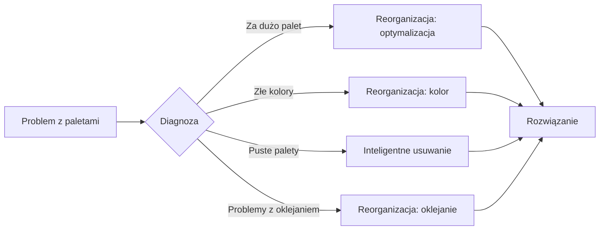

# 📦 PaletyManager V5 - Dokumentacja

## ⚠️ KRYTYCZNE: Sprawdzanie powiązań między tabelami (Foreign Keys)

### 🔴 PRZED USUWANIEM DANYCH ZAWSZE SPRAWDŹ POWIĄZANIA!

Nie przepisuj calych plików na nowo tylko modyfikuj w miejscach , tak by nie potrzebnie przpisywac to samo!!!
dotyczy się tez plików README.md - dodawaj dopisuj, poprawiaj a nie przpisuj od nowa!!

PostgreSQL używa **Foreign Key Constraints** do zachowania integralności danych. Gdy próbujesz usunąć rekord, który jest powiązany z innymi tabelami, otrzymasz błąd który **NIE JEST WIDOCZNY W KONSOLI PRZEGLĄDARKI** - tylko "500 Internal Server Error".

### Przykład problemu z paletami:
```sql
-- ❌ TO NIE ZADZIAŁA jeśli istnieją powiązania:
DELETE FROM zko.palety WHERE id = 123;
-- ERROR: update or delete on table "palety" violates foreign key constraint

-- ✅ POPRAWNE ROZWIĄZANIE:
-- Najpierw usuń powiązane rekordy
DELETE FROM zko.palety_historia WHERE paleta_id = 123;
-- Dopiero potem usuń paletę
DELETE FROM zko.palety WHERE id = 123;
```

### Jak sprawdzić powiązania tabeli:
```sql
-- Sprawdź wszystkie foreign keys wskazujące na tabelę
SELECT 
    tc.table_schema,
    tc.table_name,
    kcu.column_name,
    ccu.table_schema AS foreign_table_schema,
    ccu.table_name AS foreign_table_name,
    ccu.column_name AS foreign_column_name
FROM information_schema.table_constraints AS tc
JOIN information_schema.key_column_usage AS kcu
    ON tc.constraint_name = kcu.constraint_name
JOIN information_schema.constraint_column_usage AS ccu
    ON ccu.constraint_name = tc.constraint_name
WHERE tc.constraint_type = 'FOREIGN KEY'
    AND ccu.table_name = 'palety';  -- nazwa tabeli którą chcesz sprawdzić
```

### Tabele z powiązaniami w module Palety:
- `zko.palety` → `zko.palety_historia` (historia zmian)
- `zko.palety` → `zko.transport_palety` (transport)
- `zko.palety` → `zko.palety_formatki` (przypisania formatek)
- `zko.palety` → `zko.palety_formatki_ilosc` (ilości formatek) **🆕 NOWA TABELA**

### 🛡️ Zasady bezpieczeństwa:
1. **Zawsze sprawdzaj powiązania** przed DELETE
2. **Używaj kaskadowego usuwania** gdy to możliwe
3. **Loguj błędy backendu** - tam widać prawdziwe komunikaty SQL
4. **Testuj funkcje w pgAdmin** przed implementacją

## 🚨 INSTALACJA FUNKCJI V5 - WAŻNE!

### ⚠️ WYMAGANIA:
- PostgreSQL zainstalowany lokalnie
- Hasło do użytkownika `postgres` (domyślnie: `postgres`)
- Baza danych `alpsys` istnieje

### Szybka instalacja (Windows):
```bash
# Z głównego katalogu AlpApp
quick-install-palety-v5.bat
# Będzie pytać o hasło użytkownika postgres
```

### Ręczna instalacja (PostgreSQL):
```sql
-- Zaloguj się do bazy alpsys (będzie pytać o hasło)
psql -U postgres -h localhost -p 5432 -d alpsys

-- Wykonaj skrypty
\i D:/PROJEKTY/PROGRAMOWANIE/AlpApp/database/functions/palety_v5.sql
\i D:/PROJEKTY/PROGRAMOWANIE/AlpApp/database/functions/palety_management_v5.sql

-- Sprawdź czy funkcje się zainstalowały
SELECT routine_name FROM information_schema.routines 
WHERE routine_schema = 'zko' 
AND routine_name LIKE 'pal_%v5' OR routine_name LIKE 'pal_%v2';
```

### Instalacja przez pgAdmin:
1. Otwórz pgAdmin
2. Połącz się z bazą `alpsys`
3. Otwórz Query Tool
4. Wklej zawartość plików:
   - `database/functions/palety_v5.sql`
   - `database/functions/palety_management_v5.sql`
5. Wykonaj (F5)

### Weryfikacja instalacji:
```bash
# Test przez API (backend musi działać)
curl http://localhost:5001/api/pallets/functions/check

# Jeśli zwróci:
{
  "sukces": true,
  "dostepne_funkcje": ["pal_planuj_inteligentnie_v5", ...],
  "status": "ready"
}
# To funkcje są zainstalowane poprawnie
```

### ❌ Jeśli instalacja nie działa:
1. **Sprawdź czy PostgreSQL działa:** `pg_isready`
2. **Sprawdź hasło:** domyślne to `postgres`
3. **Sprawdź czy baza istnieje:** `psql -U postgres -l`
4. **Użyj pgAdmin** dla graficznej instalacji

## 🆕 NOWE FUNKCJE MODULARNE (2025-08-30)

### 🧩 Architektura modularna
System palet został podzielony na małe, testowalne funkcje pomocnicze które można łatwo debugować i modyfikować:

#### Funkcje pomocnicze:
1. **`pal_helper_policz_sztuki(zko_id)`** - Liczy rzeczywiste sztuki formatek
   - Zwraca: sztuk_total, typy_formatek, pozycje_count
   - Test: `SELECT * FROM zko.pal_helper_policz_sztuki(28);`

2. **`pal_helper_oblicz_parametry(sztuk, max_wysokosc, max_formatek, grubosc)`** - Oblicza parametry palet
   - Zwraca: sztuk_na_palete, liczba_palet, wysokosc_na_palete, waga_na_palete
   - Test: `SELECT * FROM zko.pal_helper_oblicz_parametry(334, 1440, 80, 18);`

3. **`pal_helper_usun_palety(zko_id)`** - Usuwa palety z obsługą FK constraints
   - Zwraca: liczba usuniętych
   - Obsługuje: palety_formatki_ilosc, palety_historia

4. **`pal_helper_utworz_palete(...)`** - Tworzy pojedynczą paletę
   - Zwraca: ID utworzonej palety
   - Parametry: zko_id, numer, sztuk, wysokosc, waga, typ

#### Główna funkcja modularna:
**`pal_planuj_modularnie(zko_id, max_wysokosc, max_formatek, nadpisz)`**
- Używa wszystkich funkcji pomocniczych
- Łatwa do debugowania (każdy krok osobno)
- Prawidłowo obsługuje RZECZYWISTE ILOŚCI sztuk

### 📊 Problem z ilościami - ROZWIĄZANY!
**Problem:** System traktował ID formatek jako sztuki zamiast sprawdzać `ilosc_planowana`
**Rozwiązanie:** 
- Nowa tabela `palety_formatki_ilosc` przechowuje rzeczywiste ilości
- Funkcje modularne prawidłowo sumują `ilosc_planowana`
- Endpoint `/api/pallets/zko/:zkoId/details` zwraca pełne dane z ilościami

### Przykład użycia:
```sql
-- Użyj funkcji modularnej zamiast błędnej V5
SELECT * FROM zko.pal_planuj_modularnie(28, 1440, 80, true);

-- Zwróci: 5 palet dla 334 sztuk (poprawnie!)
```

## 🚀 NAJWAŻNIEJSZE ZMIANY W V5

### ✨ Nowe funkcjonalności:
- **Inteligentne strategie planowania** - 6 różnych algorytmów
- **Automatyczne presets** - gotowe ustawienia dla różnych typów produkcji
- **Inteligentne usuwanie** - z automatycznym przenoszeniem formatek
- **Reorganizacja palet** - optymalizacja istniejących układów
- **Lepsze walidacje** - sprawdzanie limitów przed operacjami
- **Szczegółowe statystyki** - procent wykorzystania, wagi, etc.
- **🆕 Funkcje modularne** - łatwe testowanie i debugowanie
- **🆕 Tabela palety_formatki_ilosc** - przechowuje rzeczywiste ilości

### 🔧 Ulepszone funkcje PostgreSQL:
- `pal_planuj_inteligentnie_v5()` - Nowy algorytm planowania (MA BŁĄD Z ILOŚCIAMI!)
- `pal_usun_inteligentnie()` - Inteligentne usuwanie z transferem formatek
- `pal_reorganizuj_v5()` - Reorganizacja z optymalizacją
- `pal_wyczysc_puste_v2()` - Ulepszone czyszczenie pustych palet
- **🆕 `pal_planuj_modularnie()`** - POPRAWNA funkcja planowania z obsługą ilości
- **🆕 `pal_helper_*`** - Zestaw funkcji pomocniczych

## 🗄️ WAŻNE: Logika biznesowa w PostgreSQL

### 📌 Zasada podstawowa
**PRZED ROZPOCZĘCIEM PRACY ZAWSZE SPRAWDŹ FUNKCJE I WIDOKI W SCHEMACIE `zko`**

Logika biznesowa zarządzania paletami jest zaimplementowana w bazie danych PostgreSQL w schemacie `zko` poprzez:
- **Funkcje składowane V5** - nowe algorytmy z inteligentnymi strategiami
- **🆕 Funkcje modularne** - małe, testowalne komponenty
- **Widoki** - gotowe zestawienia i raporty o paletach
- **Triggery** - automatyczne generowanie numerów palet i historia zmian
- **Procedury** - złożone operacje logistyczne

## 📊 Nowe funkcje PostgreSQL V5

### Planowanie i tworzenie palet V5
| Funkcja | Opis | Nowe parametry | Zwraca |
|---------|------|-----------------|---------|
| `pal_planuj_inteligentnie_v5()` | ⚠️ Ma błąd z ilościami! | strategia, uwzglednij_oklejanie, nadpisz_istniejace | plan + statystyki + szczegóły |
| **`pal_planuj_modularnie()`** | 🆕 ✅ POPRAWNA wersja | max_wysokosc, max_formatek, nadpisz | sukces + palety_utworzone + statystyki |
| `pal_utworz_palety()` | Tworzenie pustych palet | zko_id, operator | sukces, komunikat, palety_utworzone |

### Funkcje pomocnicze (modularne) 🆕
| Funkcja | Opis | Parametry | Zwraca |
|---------|------|-----------|---------|
| `pal_helper_policz_sztuki()` | Liczy rzeczywiste sztuki | zko_id | sztuk_total, typy_formatek |
| `pal_helper_oblicz_parametry()` | Oblicza parametry palet | sztuk, max_wysokosc, max_formatek | sztuk_na_palete, liczba_palet |
| `pal_helper_usun_palety()` | Usuwa z obsługą FK | zko_id | liczba_usunietych |
| `pal_helper_utworz_palete()` | Tworzy pojedynczą paletę | zko_id, numer, sztuk, etc. | paleta_id |

### Zarządzanie formatkami V5 (ulepszone)
| Funkcja | Opis | Ulepszone funkcje | Zwraca |
|---------|------|-------------------|---------|
| `pal_przesun_formatki()` | Przenoszenie - lepsze walidacje | sprawdzanie statusów, logowanie | sukces + szczegółowe info |
| `pal_usun_inteligentnie()` | 🆕 Inteligentne usuwanie | auto-transfer formatek, tylko puste, force | sukces + przeniesione + ostrzeżenia |
| `pal_reorganizuj_v5()` | 🆕 Reorganizacja układu | różne strategie reorganizacji | przed/po + szczegóły |

### Obliczenia i optymalizacja V5
| Funkcja | Opis | Nowe obliczenia | Zwraca |
|---------|------|-----------------|---------|
| `pal_oblicz_parametry_v4()` | Kompleksowe obliczenia | procent wykorzystania, płyty teoretyczne vs rzeczywiste | wszystkie parametry + optymalizacje |
| `pal_wyczysc_puste_v2()` | 🆕 Czyszczenie z detalami | statystyki usuniętych, cross-ZKO | sukces + szczegóły + lista usuniętych |

## 🎯 Nowe strategie planowania V5

### 1. 🤖 Inteligentna (zalecana)
```sql
SELECT * FROM zko.pal_planuj_inteligentnie_v5(
  p_zko_id := 123,
  p_strategia := 'inteligentna',
  p_uwzglednij_oklejanie := true
);
```
**Co robi:**
- Najpierw formatki wymagające oklejania
- Grupuje po kolorach
- Optymalizuje wykorzystanie przestrzeni
- Uwzględnia rozmiary (duże na dół)

### 2. 🎨 Kolor
**Idealne dla:** Transportu do klienta, łatwej identyfikacji
- Każda paleta = jeden kolor
- Łatwe rozpoznanie i sortowanie

### 3. 📏 Rozmiar  
**Idealne dla:** Stabilności transportu
- Duże formatki na dole
- Małe na górze
- Optymalna stabilność

### 4. ✨ Oklejanie
**Idealne dla:** Procesu oklejania
- Formatki do oklejania na osobnych paletach
- Priorytet dla procesu oklejarni
- Łatwiejsze zarządzanie kolejką

### 5. 📦 Optymalizacja
**Idealne dla:** Maksymalnego wykorzystania
- Najlepsza gęstość pakowania
- Minimalna liczba palet
- Maksymalne wykorzystanie przestrzeni

### 6. 🔀 Mieszane
**Idealne dla:** Małych zleceń
- Różne kolory/rozmiary na jednej palecie
- Minimalna liczba palet

## ⚙️ Nowa integracja z React V5

```typescript
// 1. PLANOWANIE Z NOWĄ STRATEGIĄ
const planujPaletyV5 = async (zkoId: number, params: PlanowaniePaletParams) => {
  const response = await fetch(`/api/pallets/zko/${zkoId}/plan-v5`, {
    method: 'POST',
    headers: { 'Content-Type': 'application/json' },
    body: JSON.stringify({
      strategia: 'inteligentna',  // 🆕 6 strategii do wyboru
      max_wysokosc_mm: 1440,
      max_formatek_na_palete: 200,
      max_waga_kg: 700,
      grubosc_plyty: 18,
      typ_palety: 'EURO',
      uwzglednij_oklejanie: true,  // 🆕 uwzględnianie oklejania
      nadpisz_istniejace: false   // 🆕 kontrola nadpisywania
    })
  });
  
  const result = await response.json();
  
  if (result.sukces) {
    console.log(`Utworzono ${result.palety_utworzone.length} palet`);
    console.log('Statystyki:', result.statystyki);
    console.log('Plan:', result.plan_szczegolowy);
  }
  
  return result;
};

// 2. INTELIGENTNE USUWANIE Z TRANSFEREM
const usunInteligentnie = async (zkoId: number, tylkoPuste = false) => {
  const response = await fetch(`/api/pallets/zko/${zkoId}/delete-smart`, {
    method: 'DELETE',
    headers: { 'Content-Type': 'application/json' },
    body: JSON.stringify({
      tylko_puste: tylkoPuste,        // 🆕 opcja tylko pustych
      force_usun: false,              // 🆕 wymuszenie usunięcia
      operator: 'user'
    })
  });
  
  const result = await response.json();
  
  if (result.sukces) {
    console.log(`Usunięto ${result.usuniete_palety.length} palet`);
    console.log(`Przeniesiono ${result.przeniesione_formatki} formatek`);
    
    if (result.ostrzezenia.length > 0) {
      console.warn('Ostrzeżenia:', result.ostrzezenia);
    }
  }
  
  return result;
};

// 3. REORGANIZACJA PALET
const reorganizujPalety = async (zkoId: number) => {
  const response = await fetch(`/api/pallets/zko/${zkoId}/reorganize`, {
    method: 'POST',
    headers: { 'Content-Type': 'application/json' },
    body: JSON.stringify({
      strategia: 'optymalizacja',  // 🆕 różne strategie reorganizacji
      operator: 'user'
    })
  });
  
  const result = await response.json();
  
  if (result.sukces) {
    console.log('Przed:', result.przed_reorganizacja);
    console.log('Po:', result.po_reorganizacji);
  }
  
  return result;
};

// 4. ULEPSZONE PRZENOSZENIE Z WALIDACJĄ
const przenieFormatki = async (
  zPaletyId: number, 
  naPaleteId: number, 
  formatkiIds?: number[]
) => {
  const response = await fetch('/api/pallets/transfer-v5', {
    method: 'POST',
    headers: { 'Content-Type': 'application/json' },
    body: JSON.stringify({
      z_palety_id: zPaletyId,
      na_palete_id: naPaleteId,
      formatki_ids: formatkiIds,
      operator: 'user',
      powod: 'Przeniesienie przez użytkownika'
    })
  });
  
  const result = await response.json();
  
  if (result.sukces) {
    console.log('Przeniesiono formatki');
    console.log('Z palety:', result.z_palety_info);
    console.log('Na paletę:', result.na_palete_info);
  }
  
  return result;
};
```

## 🎛️ Nowe presets planowania

### Gotowe konfiguracje dla różnych przypadków:

```typescript
const PLANOWANIE_PRESETS = {
  standardowe: {
    // Typowa produkcja - balanced approach
    strategia: 'inteligentna',
    max_wysokosc_mm: 1440,
    max_waga_kg: 700,
    uwzglednij_oklejanie: true
  },
  
  wytrzymale: {
    // Ciężkie płyty - mniej wysokości, więcej wagi
    strategia: 'optymalizacja', 
    max_wysokosc_mm: 1200,
    max_waga_kg: 900,
    grubosc_plyty: 22
  },
  
  oklejanie: {
    // Specjalne dla oklejarni
    strategia: 'oklejanie',
    max_wysokosc_mm: 1000,
    max_formatek_na_palete: 100,
    uwzglednij_oklejanie: true
  },
  
  transport: {
    // Optymalne dla transportu
    strategia: 'kolor',
    max_wysokosc_mm: 1400,
    max_waga_kg: 650
  }
};
```

## 🔄 Nowy workflow pracy z paletami V5

### 1. Planowanie automatyczne


### 2. Inteligentne zarządzanie


### 3. Zaawansowane operacje


## 📊 Nowe endpointy API V5

### Planowanie palet
```http
POST /api/pallets/zko/:zkoId/plan-v5
Content-Type: application/json

{
  "strategia": "inteligentna",
  "max_wysokosc_mm": 1440,
  "max_formatek_na_palete": 200,
  "max_waga_kg": 700,
  "grubosc_plyty": 18,
  "typ_palety": "EURO",
  "uwzglednij_oklejanie": true,
  "nadpisz_istniejace": false
}
```

### Inteligentne usuwanie
```http
DELETE /api/pallets/zko/:zkoId/delete-smart
Content-Type: application/json

{
  "tylko_puste": false,
  "force_usun": false,
  "operator": "user"
}
```

### Reorganizacja
```http
POST /api/pallets/zko/:zkoId/reorganize
Content-Type: application/json

{
  "strategia": "optymalizacja",
  "operator": "user"
}
```

### Statystyki
```http
GET /api/pallets/stats/:zkoId

Response:
{
  "sukces": true,
  "statystyki": {
    "liczba_palet": 5,
    "formatki_total": 890,
    "srednie_wykorzystanie": 78,
    "puste_palety": 1,
    "najwyzsze_wykorzystanie": 95,
    "najnizsze_wykorzystanie": 45
  }
}
```

### 🆕 Szczegółowe dane z ilościami
```http
GET /api/pallets/zko/:zkoId/details

Response:
{
  "sukces": true,
  "palety": [
    {
      "id": 288,
      "numer_palety": "PAL-ZKO-00028-001",
      "sztuk_total": 80,  // rzeczywista liczba sztuk
      "formatki_szczegoly": [  // szczegółowe ilości
        {
          "formatka_id": 265,
          "ilosc": 20,
          "nazwa": "800x400 - SONOMA"
        }
      ]
    }
  ],
  "podsumowanie": {
    "typy_formatek": 13,
    "sztuk_total": 334
  }
}
```

## 🛠️ Troubleshooting V5

### ❌ Problem: Funkcje V5 źle liczą ilości formatek
**Przyczyna:** Funkcje V5 traktują ID formatek jako sztuki zamiast sprawdzać `ilosc_planowana`

**ROZWIĄZANIE:** Użyj funkcji modularnej:
```sql
-- Zamiast błędnej pal_planuj_inteligentnie_v5
SELECT * FROM zko.pal_planuj_modularnie(28, 1440, 80, true);
```

### ❌ Problem: "pal_planuj_inteligentnie_v5" does not exist
**SZYBKIE ROZWIĄZANIE przez pgAdmin:**
1. Otwórz **pgAdmin**
2. Połącz się z bazą **alpsys**
3. Kliknij prawym na **alpsys** → **Query Tool**
4. Otwórz pliki i skopiuj CAŁĄ zawartość:
   - `D:\PROJEKTY\PROGRAMOWANIE\AlpApp\database\functions\palety_v5.sql`
   - `D:\PROJEKTY\PROGRAMOWANIE\AlpApp\database\functions\palety_management_v5.sql`
5. Wklej do Query Tool (najpierw palety_v5.sql, potem palety_management_v5.sql)
6. Kliknij **Execute** (F5)
7. **Restart backend:** `restart.bat backend`

### Problem: Błędy podczas planowania palet
**Diagnoza:**
```bash
# Sprawdź dostępność funkcji V5
curl http://localhost:5001/api/pallets/functions/check
```

**Rozwiązanie:**
1. Upewnij się, że funkcje V5 są zainstalowane w bazie
2. Wykonaj: `quick-install-palety-v5.bat`
3. Sprawdź logi backendu pod kątem błędów PostgreSQL

### Problem: Funkcja V5 nie istnieje w bazie
**Rozwiązanie:** 
```bash
# Windows
quick-install-palety-v5.bat

# Lub ręcznie w PostgreSQL
\i database/functions/palety_v5.sql
\i database/functions/palety_management_v5.sql
```

### Problem: Backend nie widzi funkcji V5
**Rozwiązanie:**
```bash
# Restart backendu
restart.bat backend

# Test endpointu
curl http://localhost:5001/api/pallets/functions/check
```

### Problem: Formatki nie są poprawnie przypisywane
**Przyczyna:** Błąd w funkcji `pal_planuj_inteligentnie_v5`
**Rozwiązanie:**
```sql
-- Sprawdź strukturę pozycje_formatki
SELECT pf.*, p.kolor_plyty 
FROM zko.pozycje_formatki pf
JOIN zko.pozycje p ON pf.pozycja_id = p.id
WHERE p.zko_id = [ZKO_ID]
LIMIT 5;

-- Użyj funkcji modularnej zamiast V5
SELECT * FROM zko.pal_planuj_modularnie([ZKO_ID], 1440, 80, true);
```

### Problem: Inteligentne usuwanie nie działa
**Diagnoza:**
```sql
-- Sprawdź statusy palet
SELECT numer_palety, status, ilosc_formatek, formatki_ids
FROM zko.palety 
WHERE zko_id = [ZKO_ID];
```

**Rozwiązanie:** Sprawdź czy palety nie mają statusu blokującego (`wyslana`, `dostarczona`)

### Problem: Strategia 'inteligentna' działa zbyt wolno
**Rozwiązanie:** Użyj strategii 'kolor' lub 'optymalizacja' dla dużych ZKO

### Problem: Reorganizacja tworzy za dużo palet
**Rozwiązanie:** Zwiększ `max_formatek_na_palete` lub zmień strategię na 'optymalizacja'

### Problem: Formatki się gubią podczas transferu
**Rozwiązanie:** Funkcja `pal_przesun_formatki` ma teraz pełne logowanie - sprawdź `zko.historia_statusow`

## 📈 Metryki i KPI V5

### Nowe wskaźniki do monitorowania
1. **Wykorzystanie palety V5** = (rzeczywista wysokość / max wysokość) * 100%
2. **Efektywność strategii** = (formatki na palecie / max formatki) * 100%
3. **Jednorodność kolorowa** = (główny kolor / wszystkie formatki) * 100%
4. **Wskaźnik reorganizacji** = liczba operacji przeniesienia / total formatki
5. **Czas realizacji** = czas od planowania do zamknięcia wszystkich palet

### Cele optymalizacji V5
- Wykorzystanie palety > 85%
- Jednorodność koloru > 95% (strategia 'kolor')
- Reorganizacje < 5% formatek
- Puste palety < 10% wszystkich palet
- Czas planowania < 30 sekund

## 🚨 Limity i ograniczenia V5

### Nowe limity systemowe
```typescript
const LIMITY_PALETY_V5 = {
  MAX_WYSOKOSC_MM: 1600,        // Zwiększono z 1500
  DOMYSLNA_WYSOKOSC_MM: 1440,
  OPTYMALNA_WYSOKOSC_MM: 1200,  // 🆕 Nowy limit optymalny
  
  MAX_FORMATEK: 500,
  DOMYSLNE_FORMATEK: 200,
  OPTYMALNE_FORMATEK_MIN: 150,  // 🆕 Zakres optymalny
  OPTYMALNE_FORMATEK_MAX: 250,
  
  MAX_WAGA_KG: 1000,
  DOMYSLNA_WAGA_KG: 700,
  OPTYMALNA_WAGA_KG: 600,       // 🆕 Optymalna waga
  
  MIN_WYKORZYSTANIE_PROCENT: 70, // 🆕 Minimalne wykorzystanie
  OPTYMALNE_WYKORZYSTANIE_PROCENT: 85
};
```

### Walidacje przed operacjami
- Sprawdzenie statusów palet przed usunięciem
- Walidacja limitów przed przenoszeniem formatek
- Kontrola wykorzystania przed dodaniem formatek
- Sprawdzenie kompatybilności kolorów (strategia 'kolor')

## 🔍 Diagnostyka problemów V5

### Sprawdzenie funkcji
```bash
# Test dostępności funkcji V5
curl http://localhost:5001/api/pallets/functions/check

# Oczekiwany wynik:
{
  "sukces": true,
  "dostepne_funkcje": [
    "pal_planuj_inteligentnie_v5",
    "pal_usun_inteligentnie", 
    "pal_reorganizuj_v5",
    "pal_wyczysc_puste_v2",
    "pal_helper_policz_sztuki",
    "pal_helper_oblicz_parametry",
    "pal_planuj_modularnie"
  ],
  "wersja": "V5",
  "status": "ready"
}
```

### Test planowania
```bash
# Test planowania dla ZKO
curl -X POST http://localhost:5001/api/pallets/zko/27/plan-v5 \
  -H "Content-Type: application/json" \
  -d '{
    "strategia": "inteligentna",
    "max_wysokosc_mm": 1440,
    "max_waga_kg": 700,
    "uwzglednij_oklejanie": true
  }'
```

### Analiza statystyk
```bash
# Pobierz szczegółowe statystyki
curl http://localhost:5001/api/pallets/stats/27
```

## 🎯 Komponenty V5

### PaletyManager.tsx ⭐ (GŁÓWNY)
**Nowe funkcje:**
- `handlePlanujPaletyV5()` - Planowanie z nowymi strategiami
- `handleUsunInteligentnie()` - Inteligentne usuwanie
- `handleReorganizuj()` - Reorganizacja palet
- Lepsze obsługi błędów i walidacje

### PlanowanieModal.tsx ⭐ (ULEPSZONE)
**Nowe funkcje:**
- Presets dla różnych typów produkcji
- Wizualne przedstawienie strategii
- Real-time podgląd ustawień
- Walidacja parametrów

### PaletyStats.tsx (ROZSZERZONE)
**Nowe metryki:**
- Procent wykorzystania palet
- Statystyki wagi
- Analiza kolorów na paletach
- Wskaźniki optymalizacji

### 🆕 PaletyTable.tsx (NAPRAWIONE)
**Poprawki:**
- Obsługa rzeczywistych ilości sztuk
- Tooltip z szczegółami formatek
- Poprawne konwersje typów (toFixed error)
- Wsparcie dla tabeli palety_formatki_ilosc

## 🐛 Znane problemy i rozwiązania V5

### Problem: Funkcja V5 nie istnieje w bazie
**Rozwiązanie:** 
```sql
-- Wykonaj skrypty instalacyjne
\i database/functions/palety_v5.sql
\i database/functions/palety_management_v5.sql
```

### Problem: Błąd 500 bez szczegółów
**Przyczyna:** Foreign key constraint violation
**Rozwiązanie:** Sprawdź powiązania i usuń najpierw rekordy zależne

### Problem: Strategia 'inteligentna' działa zbyt wolno
**Rozwiązanie:** Użyj strategii 'kolor' lub 'optymalizacja' dla dużych ZKO

### Problem: Reorganizacja tworzy za dużo palet
**Rozwiązanie:** Zwiększ `max_formatek_na_palete` lub zmień strategię na 'optymalizacja'

### Problem: Formatki się gubią podczas transferu
**Rozwiązanie:** Funkcja `pal_przesun_formatki` ma teraz pełne logowanie - sprawdź `zko.historia_statusow`

### 🆕 Problem: System pokazuje liczbę typów zamiast sztuk
**Przyczyna:** Funkcje V5 źle interpretują dane
**Rozwiązanie:** Użyj funkcji modularnej `pal_planuj_modularnie` zamiast `pal_planuj_inteligentnie_v5`

## 🔄 Migration z V4 do V5

### Co się zmieniło:
1. **Endpoint `/plan`** → `/plan-v5` (nowy algorytm)
2. **Strategia planowania** - więcej opcji
3. **Inteligentne usuwanie** - nowy endpoint `/delete-smart`
4. **Reorganizacja** - osobny endpoint `/reorganize`
5. **🆕 Tabela `palety_formatki_ilosc`** - przechowuje rzeczywiste ilości
6. **🆕 Endpoint `/details`** - zwraca pełne dane z ilościami

### Jak migrować:
1. Zainstaluj funkcje V5 w bazie danych: `quick-install-palety-v5.bat`
2. Utwórz tabelę `palety_formatki_ilosc`
3. Zastąp wywołania w komponencie React
4. Użyj funkcji modularnych zamiast V5 dla poprawnej obsługi ilości
5. Przetestuj nowe funkcjonalności
6. Opcjonalnie usuń stare endpointy V4

## 🚀 Przyszłe rozszerzenia V6

Planowane funkcjonalności:
- [ ] AI-powered planowanie z uczeniem maszynowym
- [ ] Wizualizacja 3D układu formatek na palecie
- [ ] Integracja z systemem WMS
- [ ] Automatyczne etykiety QR dla palet
- [ ] Predykcja uszkodzeń w transporcie
- [ ] Optymalizacja tras transportowych
- [ ] Dashboard analityczny czasu pracy palet
- [ ] Integracja z systemami ERP klientów

## 📚 Dokumentacja techniczna

### Pliki funkcji PostgreSQL:
- `/database/functions/palety_v5.sql` - Główne funkcje planowania (MA BŁĄD!)
- `/database/functions/palety_management_v5.sql` - Zarządzanie i usuwanie
- `/database/functions/palety_v6_fixed.sql` - Próba naprawy V6 (częściowa)
- `/database/functions/fix_palety_quantities.sql` - Poprawki ilości
- **🆕 `/database/functions/palety_modularne.sql`** - DZIAŁAJĄCE funkcje modularne

### Pliki komponentów React:
- `/apps/zko/src/modules/zko/components/PaletyManager/PaletyManager.tsx` - Główny komponent
- `/apps/zko/src/modules/zko/components/PaletyManager/components/PaletyTable.tsx` - Tabela (naprawiona)
- `/services/zko-service/src/routes/pallets/details.routes.ts` - Endpoint z ilościami

### Testy:
- `/tests/palety-v5/` - Testy jednostkowe funkcji V5
- `/scripts/testing/test-palety-v5.sh` - Testy API

### Przykłady integracji:
- `/docs/examples/palety-v5-integration.md` - Przykłady użycia w React
- `/docs/api/pallets-v5.md` - Dokumentacja API

---

## 📝 Changelog V5

### v5.1.0 (2025-08-30) - MODULAR FUNCTIONS
**Dodane:**
- ✅ Funkcje modularne (pal_helper_*, pal_planuj_modularnie)
- ✅ Tabela palety_formatki_ilosc dla rzeczywistych ilości
- ✅ Endpoint /api/pallets/zko/:zkoId/details z pełnymi danymi
- ✅ Obsługa rzeczywistych ilości w PaletyTable.tsx

**Naprawione:**
- 🔧 Błąd toFixed w PaletyTable.tsx
- 🔧 System teraz prawidłowo liczy SZTUKI, nie typy
- 🔧 Poprawne tworzenie palet dla dużych ilości (334 sztuki = 5 palet)

### v5.0.2 (2025-08-30) - CRITICAL FIX
**Dodane:**
- ✅ Sekcja o Foreign Key Constraints
- ✅ Instrukcje sprawdzania powiązań tabel
- ✅ Pełne funkcje V5 z naprawionymi błędami

**Naprawione:**
- 🔧 Foreign key constraints w funkcjach usuwania
- 🔧 NULL values w kolumnach palet
- 🔧 Brakująca zmienna p_max_formatek_na_palete
- 🔧 GROUP BY w zapytaniach agregujących

### v5.0.1 (2025-08-30) - UPDATE
**Dodane:**
- ✅ Skrypty instalacyjne `quick-install-palety-v5.bat`
- ✅ Skrypt testowy `test-palety-v5.bat`
- ✅ Rozszerzona dokumentacja instalacji
- ✅ Troubleshooting dla częstych problemów

**Poprawione:**
- 🔧 Dokumentacja instalacji funkcji V5
- 🔧 Instrukcje migracji z V4 na V5

### v5.0.0 (2025-08-30)
**Dodane:**
- ✅ Funkcja `pal_planuj_inteligentnie_v5()` z 6 strategiami
- ✅ Funkcja `pal_usun_inteligentnie()` z auto-transferem
- ✅ Funkcja `pal_reorganizuj_v5()` z optymalizacją
- ✅ Presets dla różnych typów produkcji
- ✅ Endpoint `/plan-v5` z lepszą walidacją
- ✅ Endpoint `/delete-smart` z inteligentnym usuwaniem
- ✅ Endpoint `/reorganize` z optymalizacją układu
- ✅ Szczegółowe statystyki i metryki
- ✅ Ulepszone komunikaty błędów i logowanie

**Zmienione:**
- 🔄 PaletyManager.tsx - nowe funkcje i lepsze UX
- 🔄 PlanowanieModal.tsx - presets i wizualne strategie
- 🔄 Types.ts - nowe typy i interfejsy V5
- 🔄 API routing - dodano v5.routes.ts

**Deprecated:**
- ⚠️ `pal_planuj_inteligentnie_v4()` - zastąpiona przez V5
- ⚠️ Stare endpointy `/plan` - zalecane przejście na `/plan-v5`

---

## 🎯 TODO - Zadania do wykonania

### Pilne (dziś):
- [x] Zainstalować funkcje V5 w bazie PostgreSQL
- [x] Naprawić błędy Foreign Key Constraints
- [x] Przetestować endpoint `/plan-v5`
- [x] Przetestować inteligentne usuwanie
- [x] Naprawić obsługę ilości formatek
- [x] Utworzyć funkcje modularne
- [ ] Sprawdzić działanie wszystkich strategii

### Ważne (ten tydzień):
- [ ] Napisać testy jednostkowe dla funkcji modularnych
- [ ] Utworzyć endpoint używający pal_planuj_modularnie
- [ ] Migracja istniejących ZKO na nowy system
- [ ] Performance testing dla dużych ZKO

### Przyszłe:
- [ ] Usuń deprecated funkcje V4
- [ ] Napraw funkcje V5 aby prawidłowo obsługiwały ilości
- [ ] Dodaj wizualizację 3D
- [ ] Integracja z systemem etykiet

---

## 💡 Wskazówki dla deweloperów

1. **ZAWSZE sprawdzaj powiązania tabel** przed operacjami DELETE
2. **Loguj błędy backendu** - tam są prawdziwe komunikaty SQL
3. **Testuj funkcje w pgAdmin** przed wdrożeniem
4. **Używaj funkcji modularnych** - łatwiejsze debugowanie
5. **NIE używaj pal_planuj_inteligentnie_v5** - ma błąd z ilościami!
6. **Używaj pal_planuj_modularnie** - poprawnie obsługuje ilości
7. **Testuj każdą funkcję pomocniczą osobno** - łatwiej znaleźć błędy
8. **Monitoruj wykorzystanie** - cel to >85% wykorzystania palety
9. **Używaj presets** - oszczędzają czas i zapewniają optymalne ustawienia
10. **Dokumentuj zmiany** - wszystkie funkcje V5 mają wbudowane logowanie

---

**Autor:** marlowX  
**Email:** biuro@alpmeb.pl  
**Wersja:** 5.1.0  
**Data aktualizacji:** 2025-08-30
