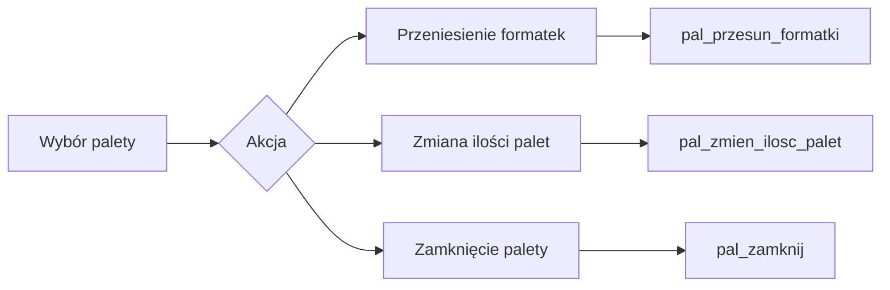
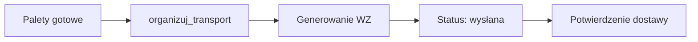

# 📦 PaletyManager - Dokumentacja

## 🗄️ WAŻNE: Logika biznesowa w PostgreSQL

### 📌 Zasada podstawowa
**PRZED ROZPOCZĘCIEM PRACY ZAWSZE SPRAWDŹ FUNKCJE I WIDOKI W SCHEMACIE `zko`**

Logika biznesowa zarządzania paletami jest zaimplementowana w bazie danych PostgreSQL w schemacie `zko` poprzez:
- **Funkcje składowane** - cała logika planowania, przenoszenia i zarządzania paletami
- **Widoki** - gotowe zestawienia i raporty o paletach
- **Triggery** - automatyczne generowanie numerów palet i historia zmian
- **Procedury** - złożone operacje logistyczne

### 🔍 Jak pracować z logiką PostgreSQL

1. **Przed implementacją funkcjonalności:**
   ```sql
   -- Sprawdź dostępne funkcje związane z paletami
   SELECT routine_name, routine_type, data_type
   FROM information_schema.routines
   WHERE routine_schema = 'zko'
   AND routine_name LIKE 'pal_%';
   
   -- Zobacz szczegóły funkcji
   \df+ zko.pal_planuj_inteligentnie_v4
   ```

2. **Analiza widoków:**
   ```sql
   -- Lista widoków związanych z paletami
   SELECT table_name 
   FROM information_schema.views 
   WHERE table_schema = 'zko'
   AND table_name LIKE '%palet%';
   ```

## 📊 Kluczowe funkcje PostgreSQL dla palet

### Planowanie i tworzenie palet
| Funkcja | Opis | Parametry | Zwraca |
|---------|------|-----------|---------|
| `pal_planuj_inteligentnie_v4()` | Automatyczne planowanie palet dla całego ZKO | zko_id, max_wysokosc_mm, max_formatek, grubosc_plyty | plan palet z formatkami |
| `pal_planuj_inteligentnie_v3()` | Planowanie dla pozycji | pozycja_id, operator, max_wysokosc, max_waga | palety_utworzone[] |
| `pal_utworz_palety()` | Tworzenie pustych palet | zko_id, operator | sukces, komunikat, palety_utworzone |
| `pal_planuj()` | Podstawowe planowanie | zko_id, liczba_palet, typ_palety, kierunek | palety_ids[], numery[] |

### Zarządzanie formatkami na paletach
| Funkcja | Opis | Parametry | Zwraca |
|---------|------|-----------|---------|
| `pal_przesun_formatki()` | Przenoszenie formatek między paletami | z_palety_id, na_palete_id, formatki_ids[], ilosc | sukces, komunikat |
| `pal_przenies_formatki()` | Przeniesienie pojedynczej formatki | formatka_id, z_palety_id, na_palete_id, ilosc | sukces, komunikat |
| `pal_proponuj_przy_cieciu()` | Propozycja układu przy cięciu | pozycja_id, operator | propozycja jsonb |

### Obliczenia i optymalizacja
| Funkcja | Opis | Parametry | Zwraca |
|---------|------|-----------|---------|
| `pal_oblicz_parametry_v4()` | Kompleksowe obliczenia parametrów | pozycja_id, formatki_ids[], max_wysokosc, max_waga | wszystkie parametry palety |
| `pal_oblicz_parametry_v2()` | Obliczenia z limitami | pozycja_id, formatki_ids[], max_wysokosc, max_waga | parametry z flagami przekroczeń |

### Operacje na paletach
| Funkcja | Opis | Parametry | Zwraca |
|---------|------|-----------|---------|
| `pal_zamknij()` | Zamknięcie palety | paleta_id, operator, uwagi | sukces, komunikat, paleta_info |
| `pal_zmien_ilosc_palet()` | Zmiana ilości palet w ZKO | zko_id, nowa_ilosc | sukces, komunikat |
| `pal_wyczysc_puste()` | Usunięcie pustych palet | pozycja_id | sukces, usuniete |

### Logistyka i transport
| Funkcja | Opis | Parametry | Zwraca |
|---------|------|-----------|---------|
| `organizuj_transport()` | Organizacja transportu palet | palety_ids[], kierunek, typ_transportu, przewoznik | transport_id, dokument_wz |
| `przyjmij_na_bufor_okleiniarka()` | Przyjęcie na bufor | paleta_id, miejsce, operator, priorytet | sukces, miejsce_id, info_bufora |
| `stan_bufora_okleiniarka()` | Stan bufora | - | miejsca, palety, czas_oczekiwania |

### Historia i logowanie
| Funkcja | Opis | Parametry | Zwraca |
|---------|------|-----------|---------|
| `loguj_zmiane_palety()` | Zapisanie zmiany w historii | paleta_id, akcja, opis, operator | id_wpisu |
| `palety_historia_trigger()` | Automatyczne logowanie zmian | - | - |

## ⚙️ Integracja z React

```typescript
// Zawsze używaj funkcji PostgreSQL zamiast logiki w JS
const planujPalety = async (zkoId: number, params: PlanParams) => {
  // NIE rób planowania w React - PostgreSQL to zrobi optymalnie
  const result = await db.query(
    'SELECT * FROM zko.pal_planuj_inteligentnie_v4($1, $2, $3, $4)',
    [zkoId, params.max_wysokosc_mm, params.max_formatek, params.grubosc_plyty]
  );
  
  // Funkcja zwróci optymalny plan paletyzacji
  return result.rows;
};

// Przenoszenie formatek między paletami
const przenieFormatki = async (sourcePaletaId: number, targetPaletaId: number, formatki?: number[]) => {
  const result = await db.query(
    'SELECT * FROM zko.pal_przesun_formatki($1, $2, $3)',
    [sourcePaletaId, targetPaletaId, formatki]
  );
  
  if (!result.rows[0].sukces) {
    throw new Error(result.rows[0].komunikat);
  }
  
  return result.rows[0];
};
```

## ⚠️ KRYTYCZNE: Zasady tworzenia komponentów

### 📏 Limit 300 linii kodu
- **Każdy komponent może mieć maksymalnie 300 linii kodu**
- Jeśli komponent przekracza ten limit, należy go rozbić na podkomponenty
- Podkomponenty umieszczamy w tym samym katalogu
- Logikę biznesową zawsze delegujemy do PostgreSQL

### 🏗️ Struktura katalogów
```
PaletyManager/
├── components/              # Podkomponenty (max 300 linii każdy)
│   ├── PaletaCard.tsx      # Karta pojedynczej palety
│   ├── PaletaStats.tsx     # Statystyki palet
│   └── PlanowanieModal.tsx # Modal planowania
├── PaletyManager.tsx        # Główny komponent (max 300 linii)
├── PaletaDetails.tsx        # Szczegóły palety
├── PaletaPrzeniesFormatki.tsx # Przenoszenie formatek
├── hooks/                   # Custom hooks
│   └── usePaletyData.ts    # Hook do zarządzania danymi
├── utils/                   # Funkcje pomocnicze
│   └── paletaHelpers.ts    # Funkcje pomocnicze
├── types.ts                 # Definicje typów
├── index.ts                 # Eksporty
└── README.md               # Dokumentacja

```

## 🎯 Komponenty główne

### PaletyManager.tsx
**Linie kodu:** ~295 (NALEŻY ZREFAKTOROWAĆ!)
- Główny komponent zarządzania paletami
- Wyświetla listę palet z statystykami
- Obsługuje planowanie automatyczne
- Zarządza zmianą ilości palet
- **TODO:** Wydzielić statystyki do osobnego komponentu

### PaletaDetails.tsx
**Linie kodu:** ~180
- Szczegółowy podgląd palety
- Lista formatek na palecie
- Historia zmian palety
- Parametry fizyczne (waga, wysokość)

### PaletaPrzeniesFormatki.tsx
**Linie kodu:** ~220
- Interface przenoszenia formatek
- Wybór formatek do przeniesienia
- Walidacja limitów palety docelowej
- Podgląd zmian przed zatwierdzeniem

## 📈 Algorytmy planowania palet

### pal_planuj_inteligentnie_v4 - Najnowszy algorytm
1. **Grupowanie po kolorze** - formatki tego samego koloru na jednej palecie
2. **Sortowanie po rozmiarze** - największe formatki na dole
3. **Kontrola limitów:**
   - Maksymalna wysokość stosu (domyślnie 1440mm)
   - Maksymalna ilość formatek (domyślnie 200 szt)
   - Grubość płyty (domyślnie 18mm)
4. **Optymalizacja kierunku** - wzdłuż/wszerz dla lepszego wypełnienia

### Parametry limitów
| Parametr | Wartość domyślna | Min | Max | Uwagi |
|----------|-----------------|-----|-----|-------|
| max_wysokosc_mm | 1440 | 800 | 2000 | Standard EURO |
| max_formatek_na_palete | 200 | 50 | 500 | Optymalne 150-250 |
| grubosc_plyty | 18 | 10 | 36 | Zależnie od materiału |
| max_waga_kg | 700 | 300 | 1000 | Limit wózka widłowego |

## 🔄 Workflow pracy z paletami

### 1. Utworzenie palet


### 2. Modyfikacja palet


### 3. Transport i logistyka


## 💡 Dobre praktyki

### Praca z PostgreSQL
1. **Zawsze sprawdzaj dostępne funkcje** przed implementacją
2. **Nie duplikuj logiki** - używaj istniejących funkcji
3. **Obsługuj błędy z bazy** - PostgreSQL zwraca szczegółowe komunikaty
4. **Używaj transakcji** dla operacji wielokrokowych

### Optymalizacja
1. **Batch operations** - używaj funkcji zbiorczych (np. pal_przesun_formatki z tablicą)
2. **Lazy loading** - ładuj szczegóły palety tylko gdy potrzebne
3. **Cache** - cache'uj dane statyczne (typy palet, limity)
4. **Debounce** - opóźnij wywołania przy częstych zmianach

### UI/UX
1. **Wizualizacja wypełnienia** - pokazuj procent wykorzystania palety
2. **Ostrzeżenia o limitach** - informuj przed przekroczeniem
3. **Drag & Drop** - intuicyjne przenoszenie formatek
4. **Podgląd zmian** - pokazuj efekt przed zatwierdzeniem

## 🚨 Limity i ograniczenia

### Limity fizyczne palety EURO
- **Wymiary:** 1200 x 800 mm
- **Maksymalna wysokość:** 1440 mm (z paletą 1584 mm)
- **Maksymalna waga:** 700-1000 kg (zależnie od wózka)
- **Maksymalne obciążenie statyczne:** 4000 kg

### Limity systemowe
- **Formatek na palecie:** max 500 (optymalne 150-250)
- **Palet w ZKO:** bez limitu (zalecane <100)
- **Kolorów na palecie:** zalecany 1 (dla łatwiejszej logistyki)

## 📊 Metryki i KPI

### Wskaźniki do monitorowania
1. **Wykorzystanie palety** = (rzeczywista wysokość / max wysokość) * 100%
2. **Efektywność paletyzacji** = (ilość formatek / max formatek) * 100%
3. **Jednorodność koloru** = (najliczniejszy kolor / wszystkie formatki) * 100%
4. **Czas paletyzacji** = czas od utworzenia do zamknięcia palety

### Cele optymalizacji
- Wykorzystanie palety > 85%
- Jednorodność koloru > 95%
- Czas paletyzacji < 2 godziny
- Ilość przesunięć formatek < 5% całości

## 🐛 Znane problemy i rozwiązania

### Problem: Przekroczenie wysokości palety
**Rozwiązanie:** Funkcja `pal_planuj_inteligentnie_v4` automatycznie tworzy nową paletę

### Problem: Mieszanie kolorów na palecie
**Rozwiązanie:** Użyj strategii "kolor" w planowaniu

### Problem: Puste palety po przeniesieniu
**Rozwiązanie:** Wywołaj `pal_wyczysc_puste()` po operacjach

## 📝 Przykład kompletnego flow

```typescript
// 1. Sprawdź dostępne funkcje w PostgreSQL
const checkPaletFunctions = async () => {
  const functions = await db.query(`
    SELECT routine_name, data_type 
    FROM information_schema.routines 
    WHERE routine_schema = 'zko'
    AND routine_name LIKE 'pal_%'
  `);
  console.log('Dostępne funkcje palet:', functions);
};

// 2. Zaplanuj palety automatycznie
const planPallets = async (zkoId: number) => {
  try {
    // Funkcja PostgreSQL optymalizuje rozmieszczenie
    const result = await db.query(
      'SELECT * FROM zko.pal_planuj_inteligentnie_v4($1, $2, $3, $4)',
      [zkoId, 1440, 200, 18]
    );
    
    console.log('Plan paletyzacji:', result.rows);
    return result.rows;
  } catch (error) {
    console.error('Błąd planowania:', error.message);
    throw error;
  }
};

// 3. Przenieś formatki między paletami
const transferFormats = async (
  fromPalletId: number, 
  toPalletId: number,
  formatIds?: number[]
) => {
  const result = await db.query(
    'SELECT * FROM zko.pal_przesun_formatki($1, $2, $3, $4)',
    [fromPalletId, toPalletId, formatIds, 'operator']
  );
  
  if (result.rows[0].sukces) {
    message.success(result.rows[0].komunikat);
    return result.rows[0];
  } else {
    message.error(result.rows[0].komunikat);
    throw new Error(result.rows[0].komunikat);
  }
};

// 4. Zamknij paletę
const closePallet = async (palletId: number) => {
  const result = await db.query(
    'SELECT * FROM zko.pal_zamknij($1, $2, $3)',
    [palletId, 'operator', 'Paleta kompletna']
  );
  
  if (result.rows[0].sukces) {
    message.success('Paleta zamknięta');
    return result.rows[0].paleta_info;
  } else {
    throw new Error(result.rows[0].komunikat);
  }
};

// 5. Organizuj transport
const organizeTransport = async (palletIds: number[]) => {
  const result = await db.query(
    'SELECT * FROM zko.organizuj_transport($1, $2, $3)',
    [palletIds, 'klient', 'ZEWNETRZNY']
  );
  
  if (result.rows[0].sukces) {
    console.log('WZ:', result.rows[0].dokument_wz);
    return result.rows[0];
  } else {
    throw new Error(result.rows[0].komunikat);
  }
};
```

## 🚀 Rozszerzenia przyszłe

- [ ] Wizualizacja 3D układu formatek na palecie
- [ ] Optymalizacja AI dla planowania palet
- [ ] Integracja z systemem WMS
- [ ] Generowanie etykiet i kodów QR dla palet
- [ ] Śledzenie GPS palet w transporcie
- [ ] Analiza predykcyjna uszkodzeń w transporcie
- [ ] Automatyczne sugestie reorganizacji palet
- [ ] Dashboard analityczny wykorzystania palet

## 📚 Materiały dodatkowe

### Dokumentacja funkcji
Szczegółowa dokumentacja każdej funkcji PostgreSQL znajduje się w:
- `/database/functions/palety/` - definicje funkcji
- `/database/docs/palety.md` - dokumentacja biznesowa

### Testy
- `/tests/palety/` - testy jednostkowe i integracyjne
- `/tests/e2e/palety.spec.ts` - testy E2E

### Standardy branży
- PN-EN 13698-1 - Specyfikacja palet EURO
- ISO 6780 - Standardy palet płaskich
- EPAL - European Pallet Association Guidelines